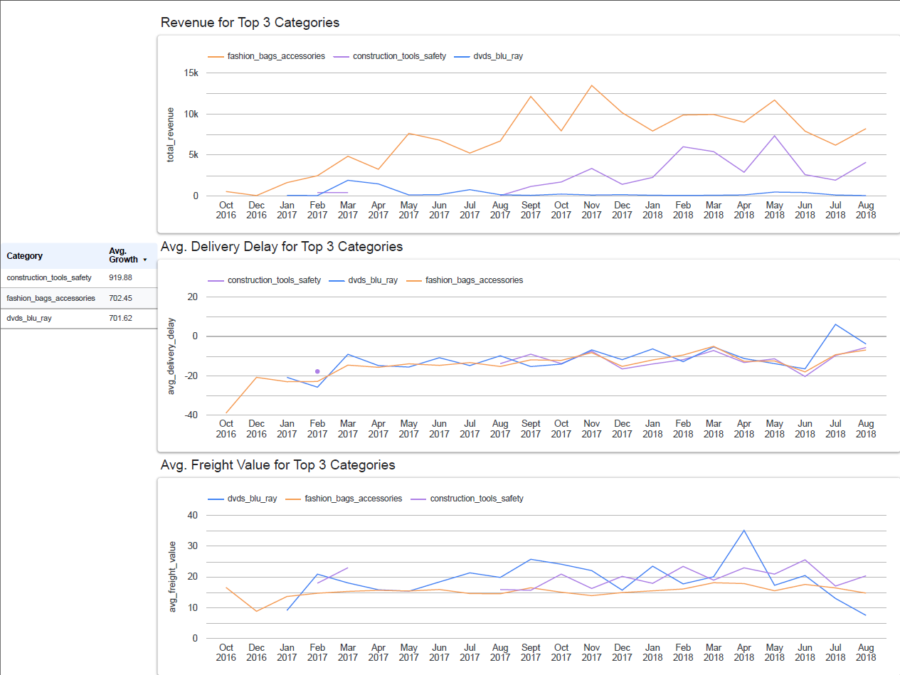
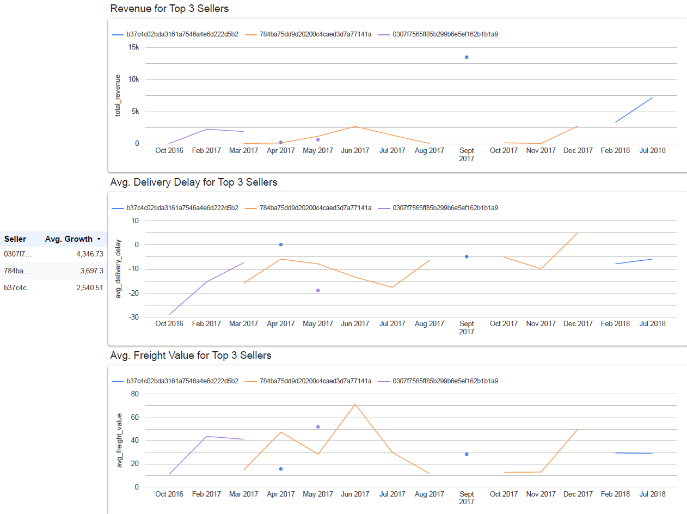
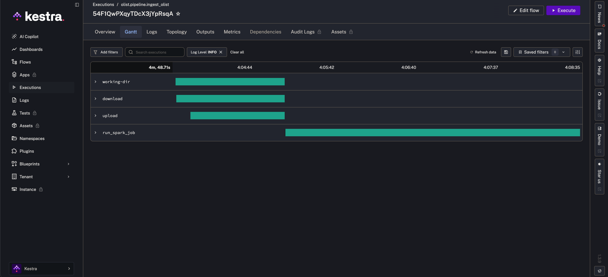

# Olist e-Commerce Growth Analysis Pipeline

A data engineering project that transforms Olist's Brazilian e-commerce data into seller and category-level growth insights. It identifies which categories and sellers are growing over time, and whether operational problems — delivery delays, high freight costs — constrain that growth.

## Problem Statement

E-commerce platforms need to understand which product categories and sellers are driving growth, and where operational inefficiencies are holding them back. This pipeline ingests, processes, and visualizes transactional data from Olist to answer two core business questions:

1. **Which product categories and sellers show the strongest month-over-month revenue growth?**
2. **Do operational problems — delivery delays and freight costs — correlate with revenue decline?**

## Live Dashboard

🛒 [Olist E-Commerce Growth Analysis Dashboard](https://lookerstudio.google.com/reporting/0017d80f-6a66-4952-a434-7b0454e6d624)




## Data Notes

**Seller activity distribution:** The majority of sellers in this dataset were active for only 1–3 months during the 2016–2018 period. This reflects the nature of the Olist marketplace — many sellers join, sell briefly, and become inactive. As a result, month-over-month growth calculations are only meaningful for sellers with sustained activity. Sellers with fewer than 3 months of data are excluded from the growth summary models.

**Category coverage over time:** Not all product categories appear in every month of the dataset. Some categories have sparse early data (late 2016 – early 2017) as the platform was still growing. Growth trends for these categories should be interpreted with this ramp-up period in mind.

**Delivery delay interpretation:** `avg_delivery_delay` is calculated as actual delivery date minus estimated delivery date. Negative values indicate early delivery (good operational performance). Positive values indicate late delivery. Null values indicate orders that were not yet delivered at the time of data collection.

**Payment aggregation:** Some orders contain multiple payment methods (e.g. credit card + voucher). Payment data is pre-aggregated before joining to avoid row multiplication in the denormalized table.

## Pipeline Execution (Gantt)



## Architecture
```
Olist Brazilian E-Commerce (Kaggle, 8 CSV tables)
        ↓
   Kestra (Orchestration)
        ↓
Google Cloud Storage (Data Lake)
        ↓
Apache Spark (8-table join → denormalized orders_enriched)
        ↓
BigQuery raw.orders_enriched
        ↓
dbt Staging → Intermediate → Marts
        ↓
Looker Studio Dashboard
```

## Tech Stack

| Layer | Tool | Purpose |
|---|---|---|
| Infrastructure (IaC) | Terraform | Provisions GCS bucket and BigQuery datasets |
| Orchestration | Kestra | End-to-end pipeline orchestration |
| Data Lake | Google Cloud Storage | Raw CSV storage |
| Processing | Apache Spark | 8-table join, denormalization, BigQuery write |
| Data Warehouse | BigQuery | Analytical tables |
| Transformation | dbt | Staging → Intermediate → Marts layers |
| Visualization | Looker Studio | Interactive dashboard |
| Containerization | Docker Compose | Kestra + Spark runtime |

## Dataset

[Olist Brazilian E-Commerce](https://www.kaggle.com/datasets/olistbr/brazilian-ecommerce) — 100k+ orders from 2016 to 2018 across multiple marketplaces in Brazil. Published by Olist on Kaggle. The dataset consists of 8 relational tables covering orders, order items, customers, sellers, products, payments, reviews, and geolocation.

## Data Warehouse Design

Spark joins all 8 source tables into a single denormalized table `raw.orders_enriched`. This design choice moves the join complexity to Spark — a tool built for large-scale data processing — rather than distributing it across dbt models. The result is a single wide table that dbt can aggregate directly without repeated joins.

**Key design decisions:**
- Portuguese-language review comment columns excluded from `orders_enriched` (not used in analysis)
- Payment data aggregated before joining to avoid row multiplication from multiple payment methods per order

## dbt Transformations
```
├── staging/
│   └── stg_orders_with_details.sql          # Rename columns, type casting
│                                             # Grain: one row per order item
├── intermediate/
│   ├── int_category_monthly_metrics.sql      # Aggregate by category + month
│   ├── int_seller_monthly_metrics.sql        # Aggregate by seller + month
│   ├── int_category_growth_metrics.sql       # MoM growth via LAG window function
│   └── int_seller_growth_metrics.sql         # MoM growth via LAG window function
└── marts/
    ├── marts_category_monthly_metrics.sql    # Category trends → Line charts
    ├── marts_seller_monthly_metrics.sql      # Seller trends → Line charts
    ├── mart_category_growth_summary.sql      # Avg growth per category → Top 3 table
    └── mart_seller_growth_summary.sql        # Avg growth per seller → Top 3 table
```

Key transformation decisions:
- Revenue calculated as `SUM(price)` per seller/category — excludes freight to avoid inflating seller revenue with shipping costs
- Month-over-month growth calculated using `LAG(total_revenue) OVER (PARTITION BY seller_id/category ORDER BY order_month)` 
- Sellers/categories with fewer than 3 months of data excluded from growth summary to avoid noise from one-off spikes
- `avg_delivery_delay` = actual delivery date minus estimated delivery date. Negative = early delivery (good), positive = late delivery (poor)

### dbt Tests

All models tested with generic dbt tests:
- `not_null` — on all key dimension and metric columns
- Timestamp columns (`order_approved_at`, `order_delivered_customer_date`) excluded from `not_null` tests — orders in progress legitimately have null delivery dates

```bash
dbt test  # 30/30 tests passing
```

## Reproducibility

### Prerequisites

- GCP account with billing enabled
- Docker Desktop (8GB memory recommended)
- Terraform
- Python + pip
- Kaggle account (to download the dataset)

### Step 1 — GCP Setup

1. Create a GCP project and enable the following APIs:
   - Cloud Storage API
   - BigQuery API
2. Create a service account with **Storage Admin** and **BigQuery Admin** roles
3. Download the JSON key and place it at `credentials/gcp-key.json`

### Step 2 — Infrastructure
```bash
cd terraform
terraform init
terraform apply
```

This provisions:
- GCS bucket: `olist-ecommerce-pipeline-data-lake`
- BigQuery datasets: `raw`, `analytics_staging`, `analytics_intermediate`, `analytics_marts`

### Step 3 — Kaggle API Credentials

The pipeline downloads the Olist dataset directly from Kaggle via the Kaggle API inside Kestra. To enable this:

1. Go to your [Kaggle account settings](https://www.kaggle.com/settings) and generate an API token — this downloads a `kaggle.json` file
2. In Kestra KV Store, add the keys `KAGGLE_USERNAME` and `KAGGLE_KEY` with the corresponding values from `kaggle.json`

The flow will handle the download automatically when triggered.

### Step 4 — Configure Kestra

1. Start Kestra:
```bash
docker compose up -d
```
2. Open Kestra UI at `http://localhost:8080`
3. Go to **KV Store** and add the key `GCP_CREDS` with the contents of your `credentials/gcp-key.json`
4. Upload the flow from `kestra/flows/01_ingest_olist.yml`
5. Run the flow — it will upload CSVs to GCS and trigger the Spark job

### Step 5 — Run Spark Job (if running manually)
```bash
docker compose run --rm spark spark-submit \
  --driver-memory 4g \
  --executor-memory 4g \
  /opt/spark/work/orders_enriched.py
```

This reads the 8 CSVs from GCS, joins them into a single denormalized table, and writes the result to `BigQuery raw.orders_enriched`.

### Step 6 — dbt Transformations
```bash
pip install dbt-bigquery

dbt init  # follow prompts: bigquery, service_account, project=olist-ecommerce-pipeline, dataset=analytics, location=us-central1

cd dbt/olist_pipeline
dbt run
dbt test
```

### Step 7 — Dashboard

Open the [live dashboard](#) or connect your own Looker Studio report to:
- `analytics_marts.marts_category_monthly_metrics`
- `analytics_marts.marts_seller_monthly_metrics`
- `analytics_marts.mart_category_growth_summary`
- `analytics_marts.mart_seller_growth_summary`

## Project Structure
```
olist-ecommerce-pipeline/
├── terraform/               # IaC — GCS + BigQuery provisioning
├── kestra/flows/            # Orchestration flow
├── spark/                   # Spark job + Dockerfile
├── dbt/olist_pipeline/
│   └── models/
│       ├── staging/
│       ├── intermediate/
│       └── marts/
├── credentials/             # GCP key (gitignored)
├── docker-compose.yml
└── README.md
```

## Evaluation Criteria Coverage

| Criteria | Implementation |
|---|---|
| Problem description | Clearly defined business problem with 2 analytical questions |
| Cloud + IaC | GCP (GCS + BigQuery) provisioned via Terraform |
| Workflow orchestration | End-to-end Kestra pipeline: upload → GCS → Spark → BigQuery |
| Data warehouse | BigQuery with denormalized wide table design |
| Transformations | dbt with staging → intermediate → marts layers + LAG-based growth metrics |
| Dashboard | Looker Studio dashboard with cross-filter interactivity |
| Reproducibility | Step-by-step setup instructions above |

## Limitations

- **Growth metric sensitivity:** Month-over-month growth is volatile for sellers with sparse activity. Sellers with fewer than 3 active months are excluded from the growth summary, but remaining sellers may still show high variance.
- **Revenue proxy:** `SUM(price)` captures product revenue only. It excludes freight, which is a real cost component for both buyers and sellers.
- **Dataset time range:** Data covers September 2016 to August 2018. Growth trends reflect this specific period and may not generalize beyond it.
- **Seller anonymization:** Seller IDs are anonymized hashes, making individual seller interpretation limited to pattern analysis rather than business identification.
